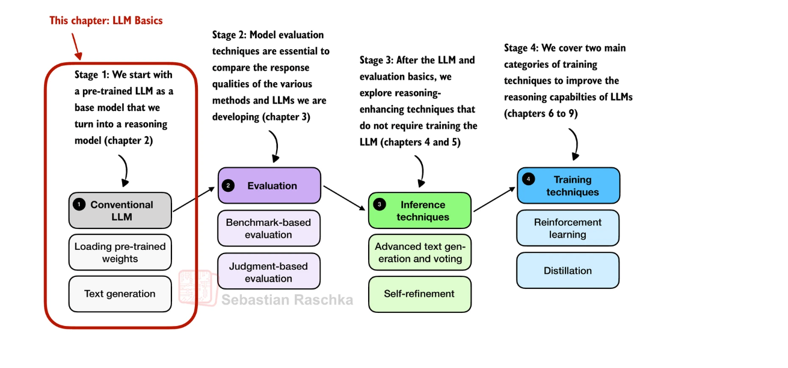

# Reasoning From Scratch

从零开始构建推理模型 - 基于 Qwen3 的语言模型学习实践

本项目基于 Sebastian Raschka 的书籍 [*Build a Reasoning Model (From Scratch)*](https://mng.bz/lZ5B)，记录学习过程中的代码实现。

---

<div align="center">
  
  <p><em>完整的学习路径和章节概览</em></p>
</div>

## 📋 环境要求

- Python 3.8+
- PyTorch 2.7.1+
- 支持的硬件：
  - NVIDIA GPU (CUDA)
  - Apple Silicon (M1/M2/M3/M4)
  - Intel GPU
  - CPU

## 🚀 快速开始

### 使用 uv 安装（推荐）

[uv](https://docs.astral.sh/uv/) 是一个快速的 Python 包管理器，推荐使用它来管理项目环境。

#### 1. 安装 uv

```bash
# macOS/Linux
curl -LsSf https://astral.sh/uv/install.sh | sh

# 或使用 pip
pip install uv
```

#### 2. 创建虚拟环境

```bash
# 创建虚拟环境
uv venv --python=python3.11 

# 激活虚拟环境
source .venv/bin/activate  # macOS/Linux
```

#### 3. 安装依赖

```bash
# 使用 uv 安装依赖（快速）
uv pip install -r requirements.txt
```

### 传统方式安装

```bash
# 创建虚拟环境
python -m venv venv
source venv/bin/activate  # macOS/Linux

# 安装依赖
pip install -r requirements.txt
```

## 📁 项目结构

```
reasoning-from-scratch/
├── README.md                          # 项目说明文档
├── requirements.txt                   # 依赖列表
├── ch02/                             # 第2章：使用预训练 LLM 生成文本
│   ├── ch02_main.ipynb              # 完整的文本生成演示
│   └── qwen3/                       # 模型和分词器文件（需下载）
└── reasoning_from_scratch/           # 核心代码包
    ├── qwen3.py                     # Qwen3 模型完整实现
    ├── ch02.py                      # 第2章：文本生成核心功能
    ├── ch02_ex.py                   # 扩展功能（KV-Cache等）
    ├── utils.py                     # 工具函数
    └── ...                          # 其他章节代码（待学习）
```

## 💡 使用说明

### 快速开始

1. **下载模型和分词器**：运行 Notebook 中的下载代码
2. **打开 Jupyter Notebook**：`ch02/ch02_main.ipynb` 包含完整的交互式演示
3. **按步骤执行**：从分词到文本生成，体验完整流程

## 📚 学习内容

### ✅ 第2章：使用预训练 LLM 生成文本

从零实现 Qwen3 语言模型（0.6B 参数），包含：

- Transformer 架构（多头注意力、RoPE、FFN、RMSNorm）
- 分词器实现（基于 BPE）
- 文本生成（贪心搜索）
- 性能优化（KV-Cache、低精度推理、模型编译）

<div align="center">
  
  <p><em>第2章核心内容概览</em></p>
</div>

### 🔜 后续章节（待学习）

- 第3章：评估和验证答案
- 第4章：灵活的文本生成策略
- 更多内容...

## 📖 参考资料

- 📘 原书：[Build a Reasoning Model (From Scratch)](https://mng.bz/lZ5B) by Sebastian Raschka
- 🐙 原始仓库：[rasbt/reasoning-from-scratch](https://github.com/rasbt/reasoning-from-scratch)

## 🙏 致谢

感谢 Sebastian Raschka 博士的优秀著作和开源代码。本项目是对原书内容的学习和实践。

---

**注意**：本项目仅用于教育和研究目的。使用预训练模型请遵守相应的使用条款。
