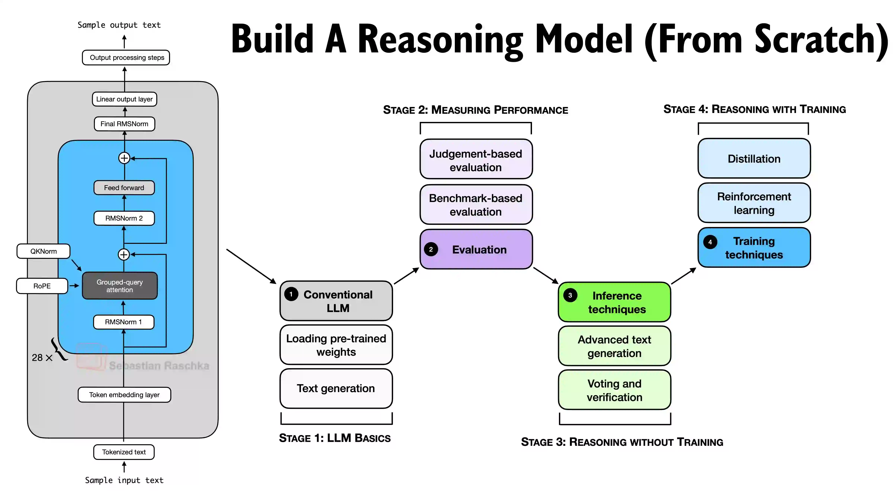
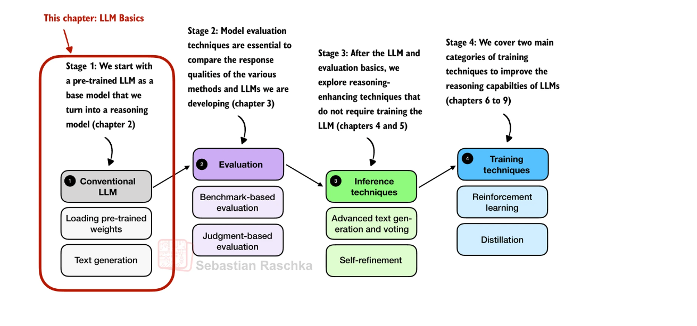
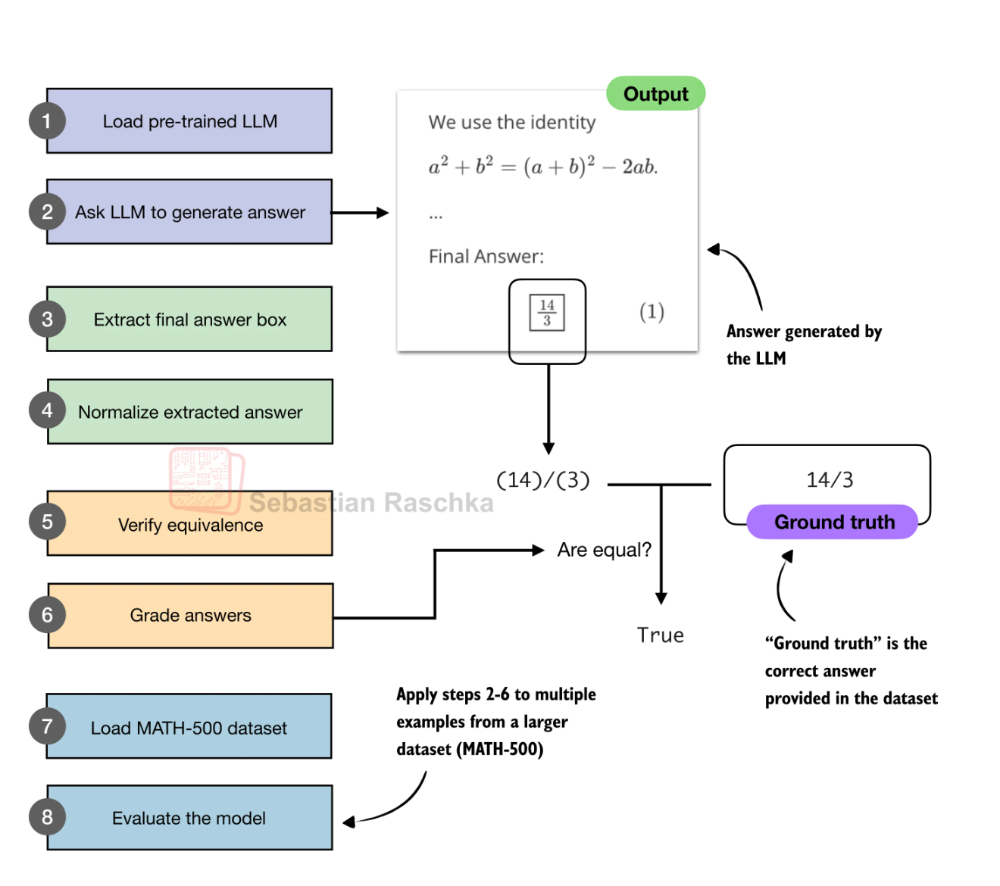
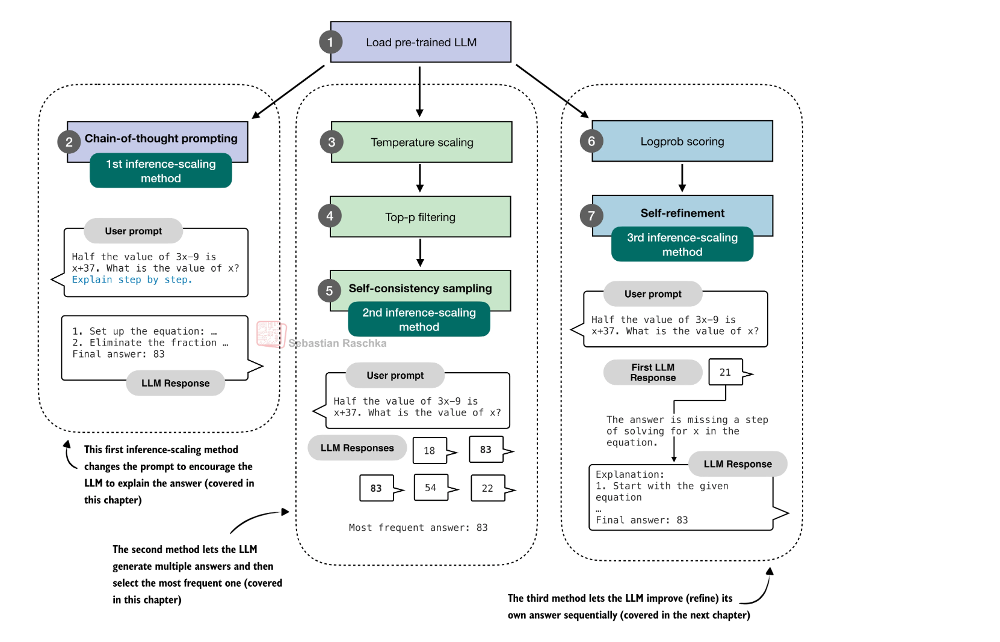
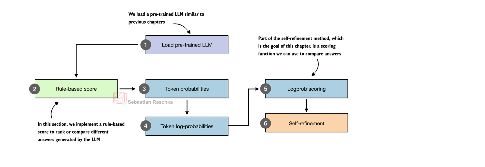
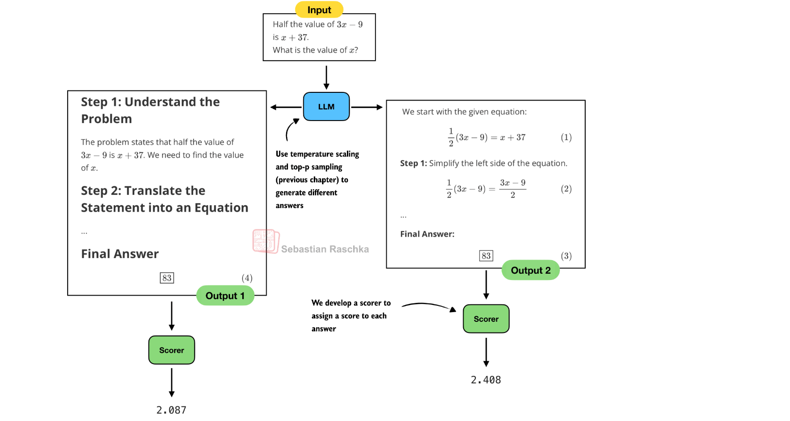
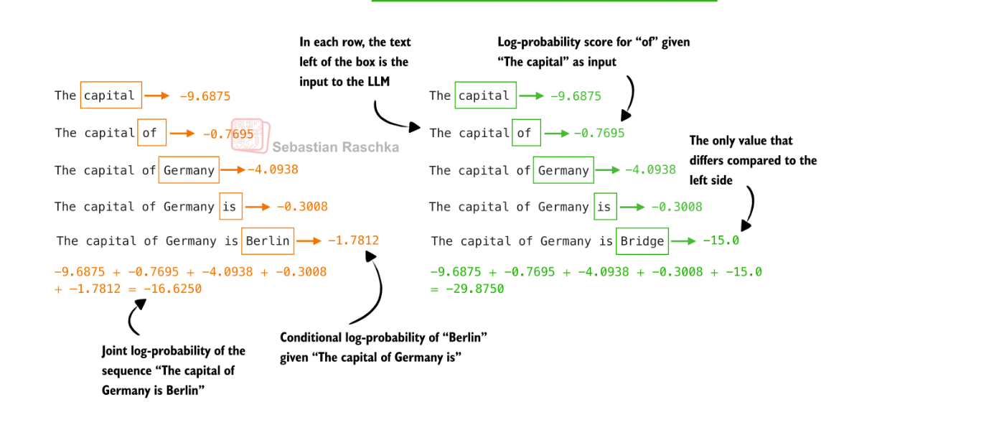
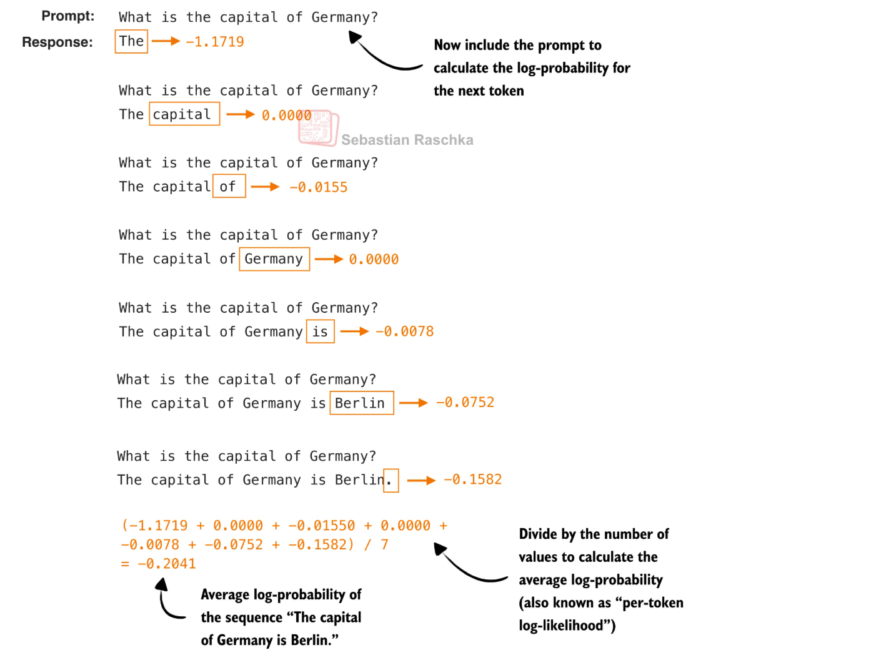
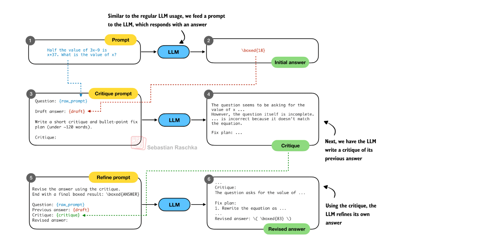
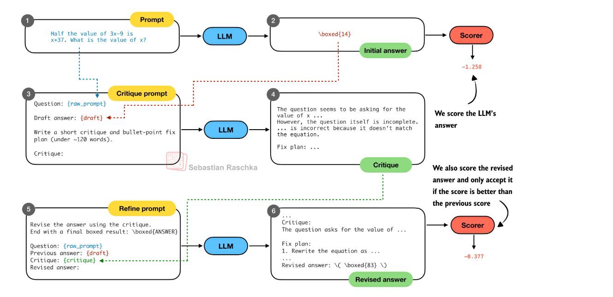

# Reasoning From Scratch

从零开始构建推理模型 - 基于 Qwen3 的语言模型学习实践

本项目基于 Sebastian Raschka 的书籍 [*Build a Reasoning Model (From Scratch)*](https://mng.bz/lZ5B)，记录学习过程中的代码实现。

---

<div align="center">
  
  <p><em>完整的学习路径和章节概览</em></p>
</div>

## 📋 环境要求

- Python 3.8+
- PyTorch 2.7.1+
- 支持的硬件：
  - NVIDIA GPU (CUDA)
  - Apple Silicon (M1/M2/M3/M4)
  - Intel GPU
  - CPU

## 🚀 快速开始

### 使用 uv 安装（推荐）

[uv](https://docs.astral.sh/uv/) 是一个快速的 Python 包管理器，推荐使用它来管理项目环境。

#### 1. 安装 uv

```bash
# macOS/Linux
curl -LsSf https://astral.sh/uv/install.sh | sh

# 或使用 pip
pip install uv
```

#### 2. 创建虚拟环境

```bash
# 创建虚拟环境
uv venv --python=python3.11 

# 激活虚拟环境
source .venv/bin/activate  # macOS/Linux
```

#### 3. 安装依赖

```bash
# 使用 uv 安装依赖（快速）
uv pip install -r requirements.txt
```

### 传统方式安装

```bash
# 创建虚拟环境
python -m venv venv
source venv/bin/activate  # macOS/Linux

# 安装依赖
pip install -r requirements.txt
```

## 📚 学习内容

### ✅ 第2章：使用预训练 LLM 生成文本

从零实现 Qwen3 语言模型（0.6B 参数），包含：

- Transformer 架构（多头注意力、RoPE、FFN、RMSNorm）
- 分词器实现（基于 BPE）
- 文本生成（贪心搜索）
- 性能优化（KV-Cache、低精度推理、模型编译）

<div align="center">
  
  <p><em>第2章核心内容概览</em></p>
</div>

### ✅ 第3章：评估和验证答案

评估推理模型的核心章节，实现完整的数学问题答案验证系统，包含：

- **答案提取**：从LLM生成文本中提取最终答案（支持 `\boxed{}` 格式）
- **文本规范化**：处理LaTeX表达式、数学符号、格式转换
- **数学等价性检验**：使用SymPy进行符号数学比较
- **数据集评估**：在MATH-500测试集上进行模型评估
- **结果分析**：计算准确率和生成长度统计

<div align="center">
  
  <p><em>第3章核心内容概览</em></p>
</div>

### ✅ 第4章：推理时缩放与灵活生成

通过推理时缩放改进推理模型，实现多种文本生成策略，包含：

- **温度缩放**：控制生成的确定性和多样性
- **Top-P（核采样）**：从累积概率超过P阈值的token中采样
- **概率采样**：基于概率分布的随机采样
- **Chain-of-Thought Prompting**：通过提示引导模型逐步推理
- **自洽投票机制**：通过多次独立采样和投票提高答案准确性
- **多种生成策略对比**：贪心、采样等方法的效果分析

<div align="center">
  
  <p><em>第4章核心内容概览：推理时缩放策略</em></p>
</div>

### ✅ 第5章：推理时缩放与自我优化

通过自我评估和迭代改进来优化模型输出，实现模型的自我反思和优化，包含：

- **启发式评分**：根据答案格式和长度对答案进行评分
- **Token概率计算**：计算生成文本的条件概率和对数概率
- **答案评估**：通过平均对数概率衡量答案的可能性
- **自我批评与改进**：使用提示工程指导模型进行自我批评
- **迭代优化循环**：通过多轮批评-改进迭代提升最终答案质量
- **动态评分机制**：根据迭代过程中的评分动态选择最优答案

<div align="center">
  
  <p><em>第5章核心内容：自我优化迭代循环</em></p>
</div>

**启发式评分示意：**
<div align="center">
  
  
  <p><em>基于答案特征的评分机制</em></p>
</div>

**自我优化迭代过程：**

<div align="center">
  
  
  
  <p><em>自我批评与改进的迭代过程</em></p>
</div>
### 🔜 后续章节（待学习）

- 第6章及更多内容...

## 📖 参考资料

- 📘 原书：[Build a Reasoning Model (From Scratch)](https://mng.bz/lZ5B) by Sebastian Raschka
- 🐙 原始仓库：[rasbt/reasoning-from-scratch](https://github.com/rasbt/reasoning-from-scratch)

## 🙏 致谢

感谢 Sebastian Raschka 博士的优秀著作和开源代码。本项目是对原书内容的学习和实践。

---

**注意**：本项目仅用于教育和研究目的。使用预训练模型请遵守相应的使用条款。
