# Reasoning From Scratch

从零开始构建推理模型 - 基于 Qwen3 的语言模型学习实践

本项目基于 Sebastian Raschka 的书籍 [*Build a Reasoning Model (From Scratch)*](https://mng.bz/lZ5B)，记录学习过程中的代码实现。

---

<div align="center">
  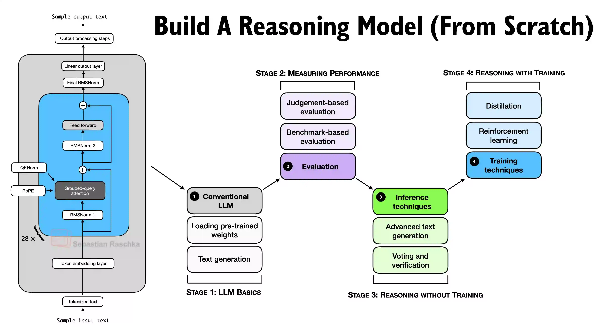
  <p><em>完整的学习路径和章节概览</em></p>
</div>

## 📋 环境要求

- Python 3.8+
- PyTorch 2.7.1+
- 支持的硬件：
  - NVIDIA GPU (CUDA)
  - Apple Silicon (M1/M2/M3/M4)
  - Intel GPU
  - CPU

## 🚀 快速开始

### 使用 uv 安装（推荐）

[uv](https://docs.astral.sh/uv/) 是一个快速的 Python 包管理器，推荐使用它来管理项目环境。

#### 1. 安装 uv

```bash
# macOS/Linux
curl -LsSf https://astral.sh/uv/install.sh | sh

# 或使用 pip
pip install uv
```

#### 2. 创建虚拟环境

```bash
# 创建虚拟环境
uv venv --python=python3.11 

# 激活虚拟环境
source .venv/bin/activate  # macOS/Linux
```

#### 3. 安装依赖

```bash
# 使用 uv 安装依赖（快速）
uv pip install -r requirements.txt
```

### 传统方式安装

```bash
# 创建虚拟环境
python -m venv venv
source venv/bin/activate  # macOS/Linux

# 安装依赖
pip install -r requirements.txt
```

## 📚 学习内容

### ✅ 第2章：使用预训练 LLM 生成文本

从零实现 Qwen3 语言模型（0.6B 参数），包含：

- Transformer 架构（多头注意力、RoPE、FFN、RMSNorm）
- 分词器实现（基于 BPE）
- 文本生成（贪心搜索）
- 性能优化（KV-Cache、低精度推理、模型编译）

<div align="center">
  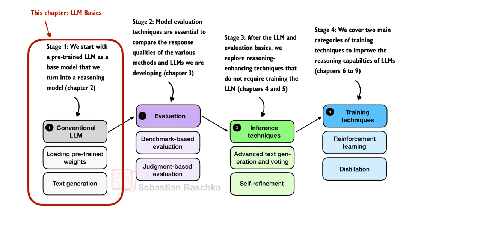
  <p><em>第2章核心内容概览</em></p>
</div>

### ✅ 第3章：评估和验证答案

评估推理模型的核心章节，实现完整的数学问题答案验证系统，包含：

- **答案提取**：从LLM生成文本中提取最终答案（支持 `\boxed{}` 格式）
- **文本规范化**：处理LaTeX表达式、数学符号、格式转换
- **数学等价性检验**：使用SymPy进行符号数学比较
- **数据集评估**：在MATH-500测试集上进行模型评估
- **结果分析**：计算准确率和生成长度统计

<div align="center">
  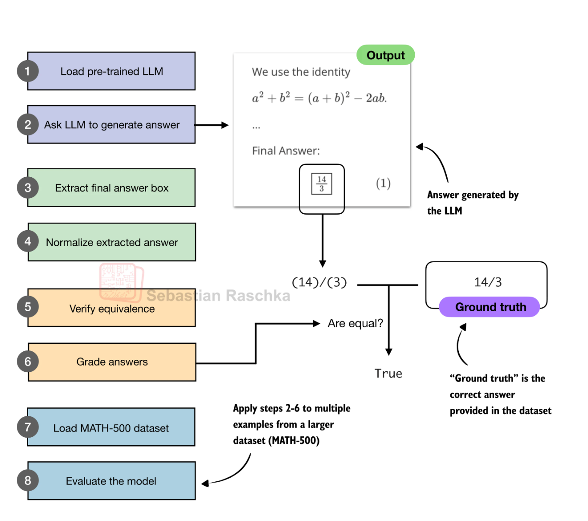
  <p><em>第3章核心内容概览</em></p>
</div>

### ✅ 第4章：推理时缩放与灵活生成

通过推理时缩放改进推理模型，实现多种文本生成策略，包含：

- **温度缩放**：控制生成的确定性和多样性
- **Top-P（核采样）**：从累积概率超过P阈值的token中采样
- **概率采样**：基于概率分布的随机采样
- **Chain-of-Thought Prompting**：通过提示引导模型逐步推理
- **自洽投票机制**：通过多次独立采样和投票提高答案准确性
- **多种生成策略对比**：贪心、采样等方法的效果分析

<div align="center">
  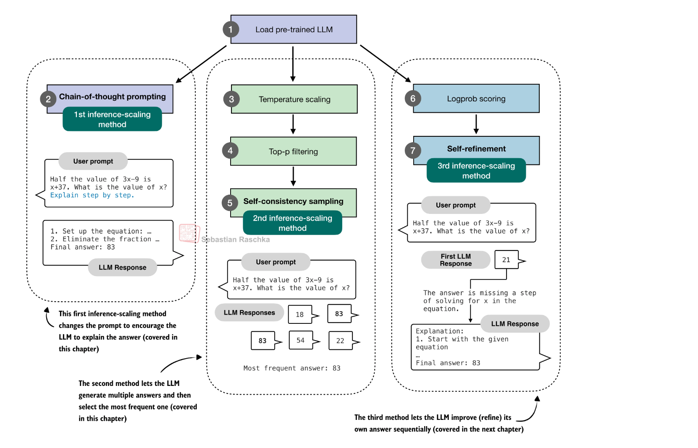
  <p><em>第4章核心内容概览：推理时缩放策略</em></p>
</div>

### ✅ 第5章：推理时缩放与自我优化

通过自我评估和迭代改进来优化模型输出，实现模型的自我反思和优化，包含：

- **启发式评分**：根据答案格式和长度对答案进行评分
- **Token概率计算**：计算生成文本的条件概率和对数概率
- **答案评估**：通过平均对数概率衡量答案的可能性
- **自我批评与改进**：使用提示工程指导模型进行自我批评
- **迭代优化循环**：通过多轮批评-改进迭代提升最终答案质量
- **动态评分机制**：根据迭代过程中的评分动态选择最优答案

<div align="center">
  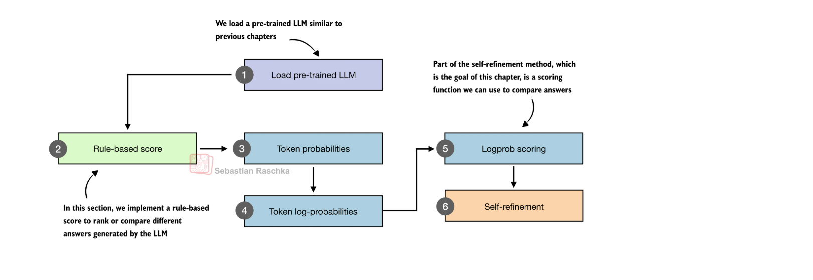
  <p><em>第5章核心内容：自我优化迭代循环</em></p>
</div>

**启发式评分示意：**

<div align="center">
  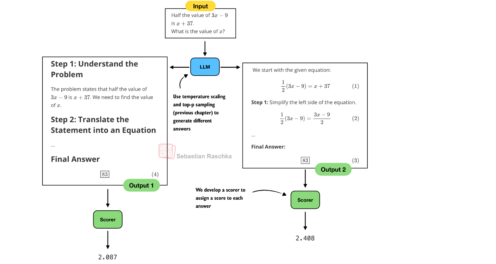
  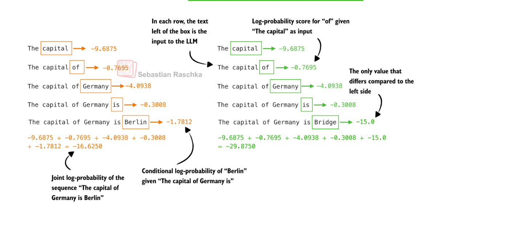
  <p><em>基于答案特征的评分机制</em></p>
</div>

**自我优化迭代过程：**

<div align="center">
  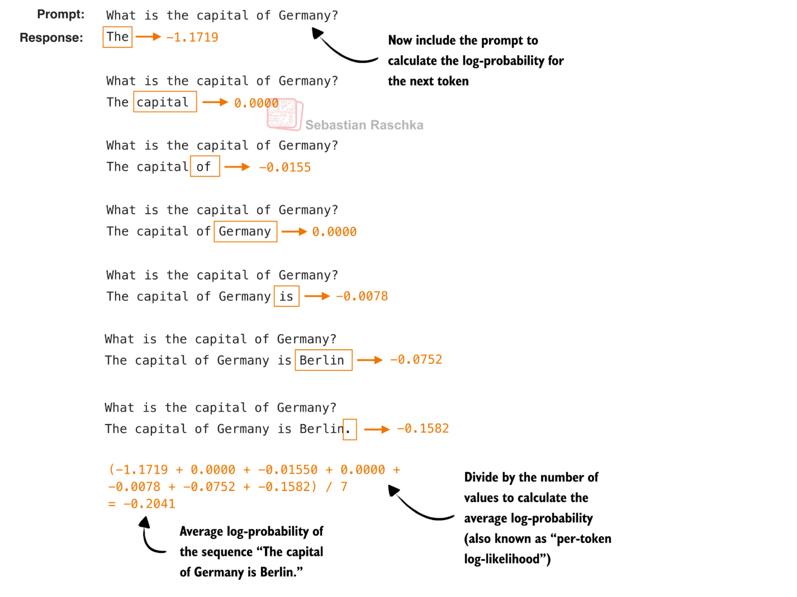
  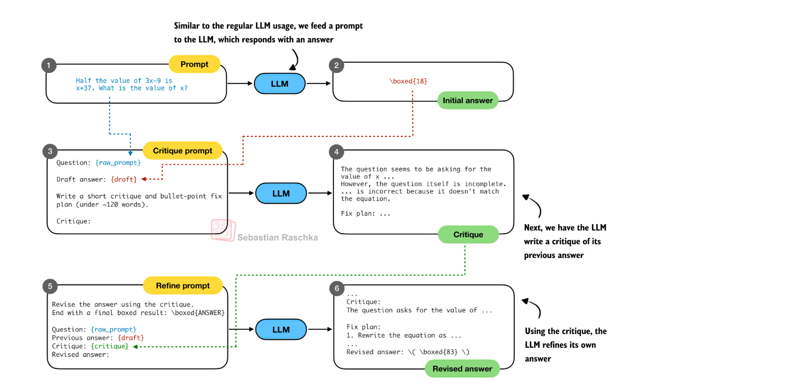
  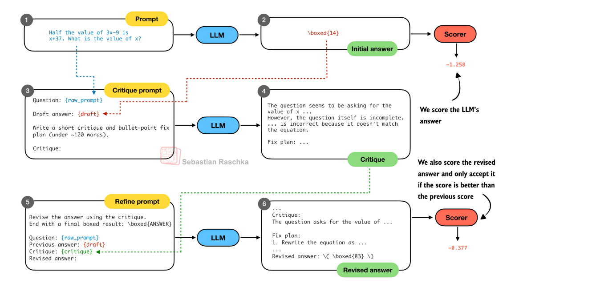
  <p><em>自我批评与改进的迭代过程</em></p>
</div>

### ✅ 第6章：基于 RLVR 与 GRPO 的强化学习微调

通过可验证奖励（RLVR）和组相对策略优化（GRPO）对模型进行后训练，实现从采样到奖励再到策略更新的完整训练闭环，包含：

- **训练数据构建**：加载并使用数学推理训练集进行逐步训练
- **Rollout 采样生成**：结合温度缩放与 Top-P 采样生成多条候选回答
- **可验证奖励函数**：基于 `\boxed{}` 答案提取与符号等价校验计算奖励
- **组内优势估计**：对同组 Rollout 奖励进行标准化得到优势值
- **策略梯度更新**：根据 GRPO 目标计算损失并执行反向传播

<div align="center">
  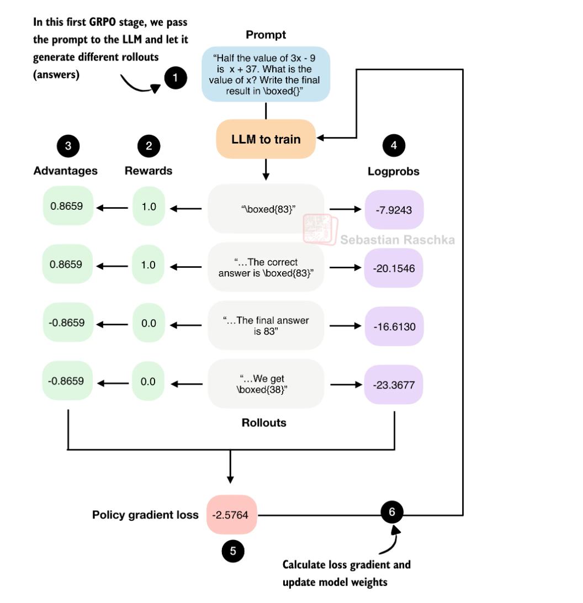
  <p><em>第6章核心内容：RLVR-GRPO 训练流程</em></p>
</div>

### ✅ 第7章：GRPO 训练稳定性与奖励设计进阶

第7章在第6章 RLVR-GRPO 基础上，重点不是“再加数据”，而是“让训练更可控、更稳定、更可诊断”。核心学习内容包括：

- **训练可观测性增强（plus tracking）**：在训练日志中加入 `adv_avg`、`adv_std`、`entropy_avg`、`avg_response_len`、`tokens_per_sec` 等指标，便于定位奖励稀疏、策略坍塌和采样异常问题。
- **PPO 风格策略比率裁剪（plus clip ratio）**：从仅依赖优势加权，升级为基于 `ratio` / `clipped_ratio` 的目标函数，抑制单步更新过大导致的训练震荡。
- **KL 正则约束（plus KL）**：引入参考模型并增加 KL 惩罚项，限制策略偏移速度，在“探索能力”和“输出稳定性”之间建立可调平衡。
- **格式奖励（plus format reward）**：在答案正确性奖励外增加结构化输出奖励（如 `<think>...</think>` 约束），把“答对”与“答得规范”统一进同一奖励体系。

<div align="center">
  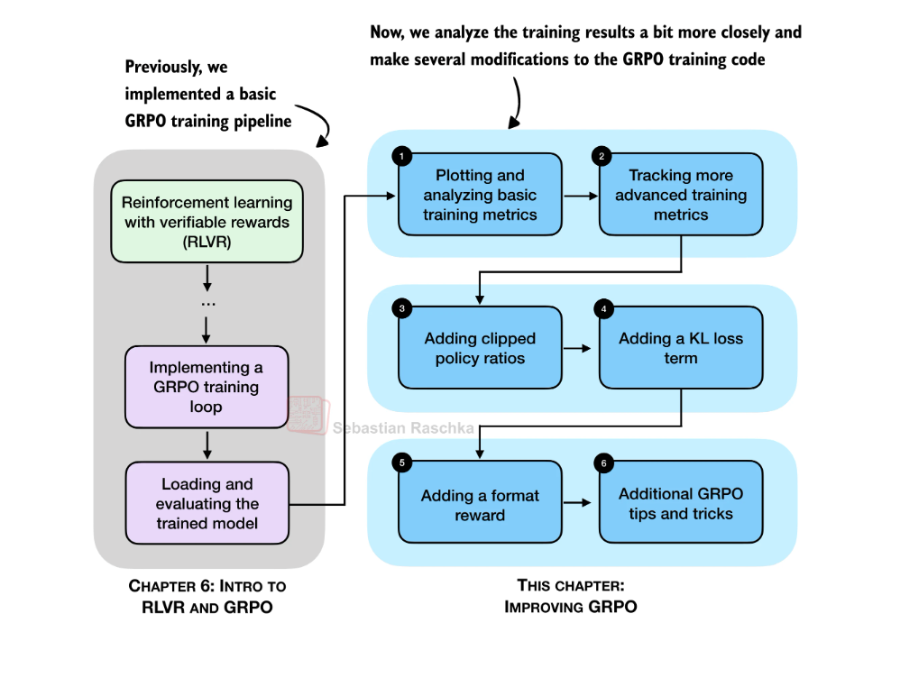
  <p><em>第7章核心内容：从可观测性、约束项到奖励函数设计的系统优化</em></p>
</div>

### ✅ 第8章：蒸馏（Distillation）

第8章聚焦“用教师推理轨迹监督学生模型”，在保持推理能力的同时提升训练与推理效率。当前 `ch08` 已完成从数据准备到训练、日志分析与评测的完整闭环。

- **蒸馏数据构建**：加载 `deepseek-r1-math-train`，将 `problem` 渲染为提示词，拼接 `message_thinking` 与 `message_content` 作为监督目标。
- **可选 think token 训练**：支持将思维过程包装为 `<think>...</think>`（`--use_think_tokens`），也支持去除 think 标签后训练。
- **长度过滤与数据划分**：按 `max_seq_len` 过滤超长样本（默认 2048），并划分训练/验证集。
- **监督损失设计**：交叉熵仅对**答案区间**计算（不监督提示词 token），更贴近“给定问题→学习回答”的蒸馏目标。
- **训练稳定性增强**：支持梯度裁剪（`--grad_clip_norm`）、周期性验证（`--log_every`）、CSV 指标记录与 epoch 检查点保存。
- **结果评估**：提供 JSON 记录评测脚本与 MATH-500 评测脚本，便于对蒸馏前后效果做对比。


<div align="center">
  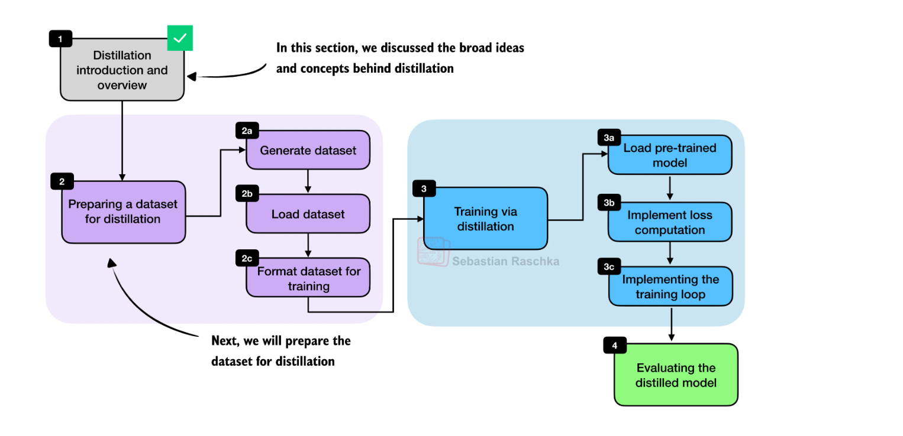
  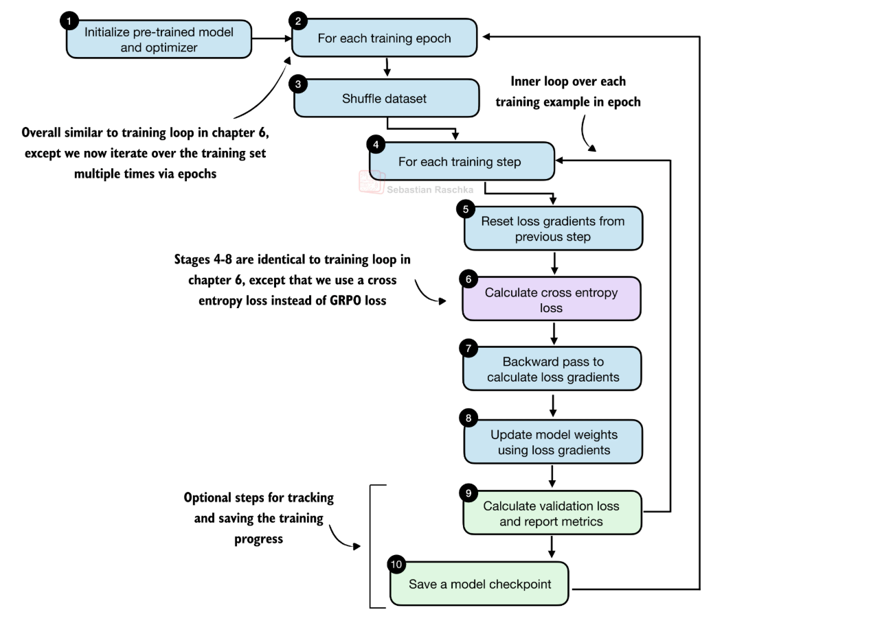
  <p><em>第8章核心内容：蒸馏数据构造、训练目标与评估流程</em></p>
</div>

## 📖 参考资料

- 📘 原书：[Build a Reasoning Model (From Scratch)](https://mng.bz/lZ5B) by Sebastian Raschka
- 🐙 原始仓库：[rasbt/reasoning-from-scratch](https://github.com/rasbt/reasoning-from-scratch)

## 🙏 致谢

感谢 Sebastian Raschka 博士的优秀著作和开源代码。本项目是对原书内容的学习和实践。

---

**注意**：本项目仅用于教育和研究目的。使用预训练模型请遵守相应的使用条款。
